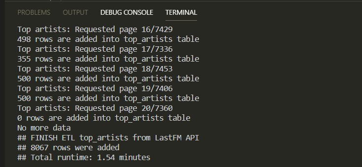
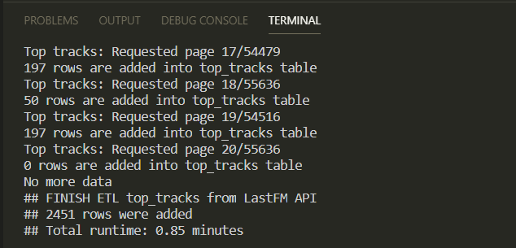
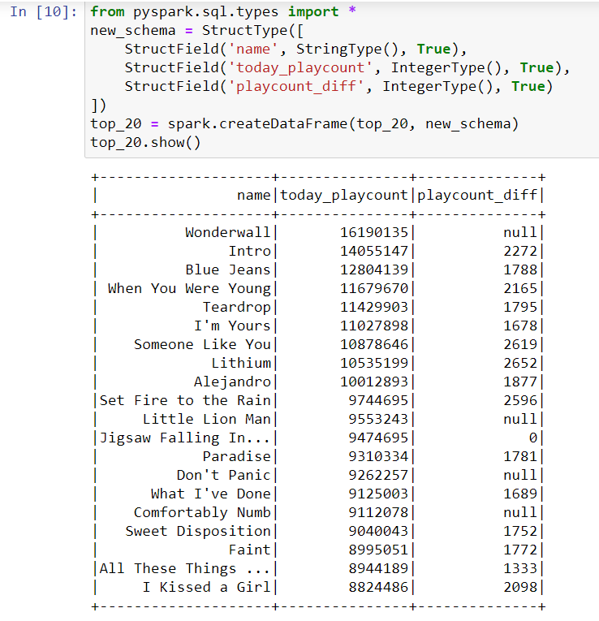

## Table of Contents
1. [Prerequisites](#Prerequisites)
2. [Data piplines for LastFM API](#paragraph1)
3. [How to run Data piplines for LastFM API](#paragraph2)

## Prerequisites
- PostgreSQL version 13.0-1
- jdbc driver version 42.2.18
- Spark version spark-3.0.1-bin-hadoop3.2
- Python 3 with packages: requests, json, pandas, sqlalchemy
- Jupyter notebook with packages: findspark, pyspark
- A new LastFM account with API key

## Data piplines for LastFM API
LastFM is a music website that offers an API to extract music data from the website: https://www.last.fm/api

This project - Data piplines for LastFM API will do the following:
1. Connect to LastFM API and extract data: 
  - top artists of the day from API `chart.gettopartists`
  - top tracks of the day from API `chart.gettoptracks`

2. Perform data transformation

3. Save transformed data into PostgreSQL

4. Use pyspark to extract data in PostgreSQL and generate a simple report of top 20 tracks for the current day.

### Set up PostgreSQL server and a new user account for data pipelines
Create a new server in PostgreSQL:
- hostname: `localhost`
- port: `5432`
- username: `api1`
- database: `openapi`
- schema: `lastfm`
- python will automatically create required tables: `top_tracks`, `top_artists` in `openapi.lastfm`

Add a new user: in `last-fm-online/postgresql-setup/add-user.sql`, there are queries to create a user with:
- username: `api1` 
- password: `Open API@1`;

## How to run Data piplines for LastFM API
### Create a new account in LastFM API
In order to access LastFM API, register an account in LastFM: https://www.last.fm/join

After the registration, request an API account with API key: https://www.last.fm/api/account/create

Details are in: https://www.radioking.com/on/knowledgebase/3232/How-to-create-a-Lastfm-API-Key.html

### Extract, transform and load data from LastFM API
In `last-fm-online`, there are 2 file files: `etl-top-artists.py`, `etl-top-tracks.py`. 
- Change the `api_key` value at line 23/24 with the provided API key from LastFM. Then run them to perform ETL.
- If there are no tables: `top_tracks`, `top_artists`. The file `sql_queries` is run to create these 2 tables in PostgreSQL

When ETL is done. There is announcement:
  

  

### Use pyspark in Jupyter to generate top 20 tracks
In Jupyter file `analysis-top-song.ipynb`, there are code to use pyspark to exact `top-tracks` table from PostgresSQL. Then it generates top 20 songs for the current day.

  

The top 20 songs are saved in `data/top-20-daily/`
